# AFL Front Office User Manual

**Welcome to the AFL Front Office!** This guide will walk you through everything you need to know to manage your franchise, from logging in to making draft-day trades.

---

## 1. Getting Started: Your First Steps

Welcome to the league! Here's how to get logged in and start managing your team.

### 1.1. Logging In

To get started, you'll need to log in to your account.

1.  Navigate to the **Login** page. You can usually find a "Login" button on the homepage.
2.  Enter your **Team Name** or **Email Address**.
3.  Enter your **Password**.
4.  Click the **Enter Front Office** button.

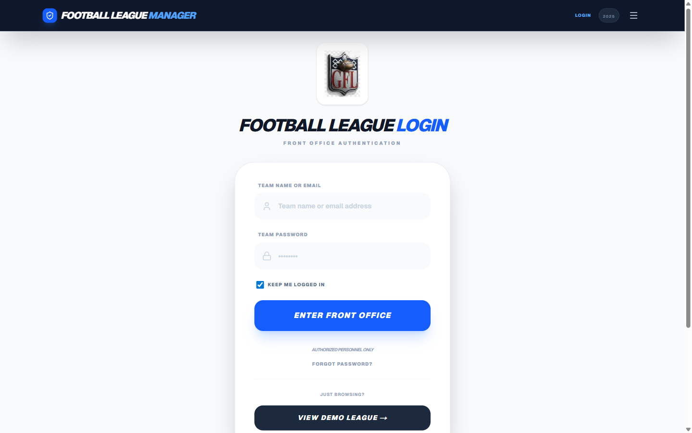

> **Pro Tip:** Keep the "Keep Me Logged In" box checked, and you'll stay logged in for 30 days!

Once you're logged in, you'll be taken to the homepage, where you'll see your franchise name in the top navigation bar.

### 1.2. New Coaches: Creating Your Account

If you're a new coach, you'll need to create an account.

1.  From the login page, click on the **"Create an Account"** link.
2.  Fill out the registration form with your details:
    *   **League ID:** Your commissioner will provide this.
    *   **Coach Name:** Your full name.
    *   **Team Name:** Your franchise name (e.g., "Amalfi").
    *   **Shortcode:** A unique 3-6 character abbreviation for your team (e.g., "AFL").
    *   **Email & Mobile:** Optional, but recommended for league communications.
    *   **Password:** Choose a secure password (at least 6 characters).
3.  Click **Submit Registration**.

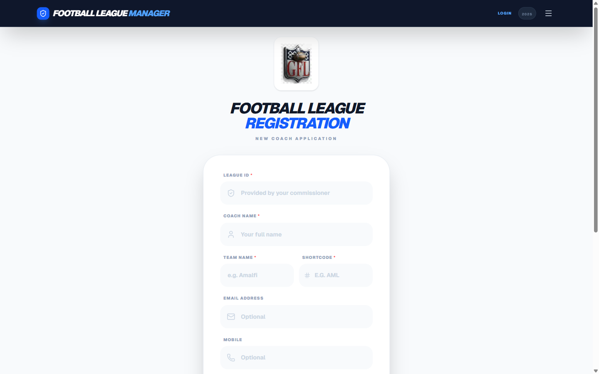

After you register, your account will be **pending approval** from the league commissioner. They'll let you know when your account is active and ready to use.

### 1.3. Forgot Your Password?

It happens to the best of us. If you forget your password:

1.  On the login page, click the **"Forgot Password?"** link.
2.  A window will pop up with the commissioner's contact info.
3.  Click **"Send Recovery Email"** to send a pre-filled email to the commissioner asking for a password reset. The commissioner will then reset your password and get in touch with you.

---

## 2. The Home Page: Your Central Hub

The home page is your command center. From here, you can access all the major features of the AFL Front Office.

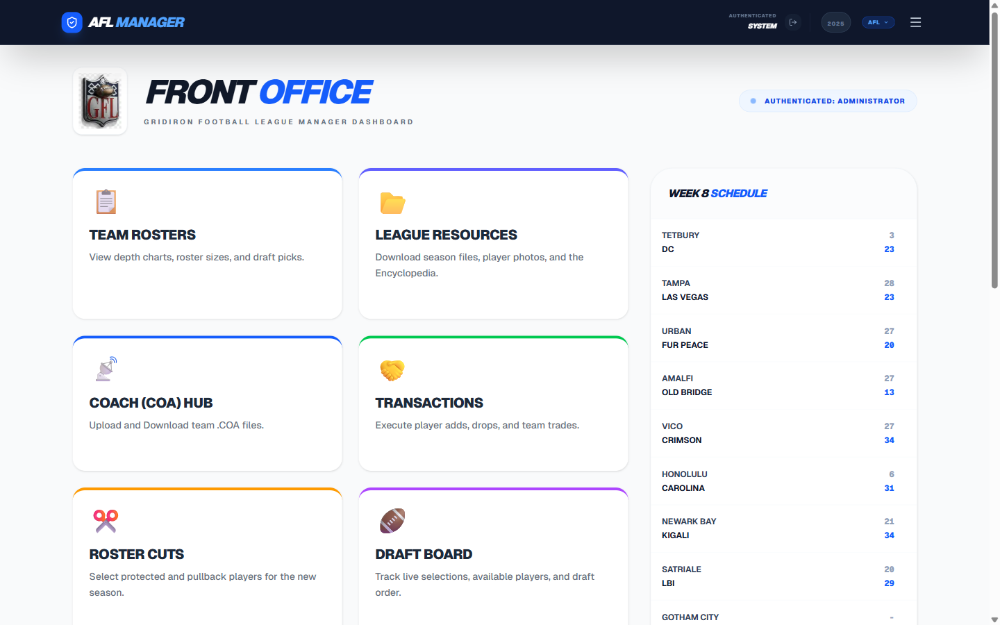

### Feature Cards

The main area of the home page is a grid of **feature cards**. Each card is a link to a different part of the application. Some cards may require you to be logged in.

Here's a quick overview of the cards:

*   **Team Rosters:** View and search every team's roster and depth chart.
*   **League Resources:** Download league files, documents, and other assets.
*   **Coach (COA) Hub:** Upload and download your `.COA` gameday file.
*   **Transactions:** Add, drop, and trade players.
*   **Roster Cuts:** Submit your protected and pullback player selections for the new season.
*   **Draft Board:** The live hub for all draft activity.
*   **Standings:** Check out the current season standings and league history.
*   **Franchise Settings:** Update your profile and change your password.
*   **Commissioner:** The league management panel (for commissioners only).

### Weekly Schedule Widget

On the right side of the page, you'll find the **Weekly Schedule Widget**. This shows the current week's matchups, including scores for completed games.

---

## 3. Team Rosters: Know Your Squad (and Your Rivals)

The **Team Rosters** page is where you can see the full roster for every team in the league.

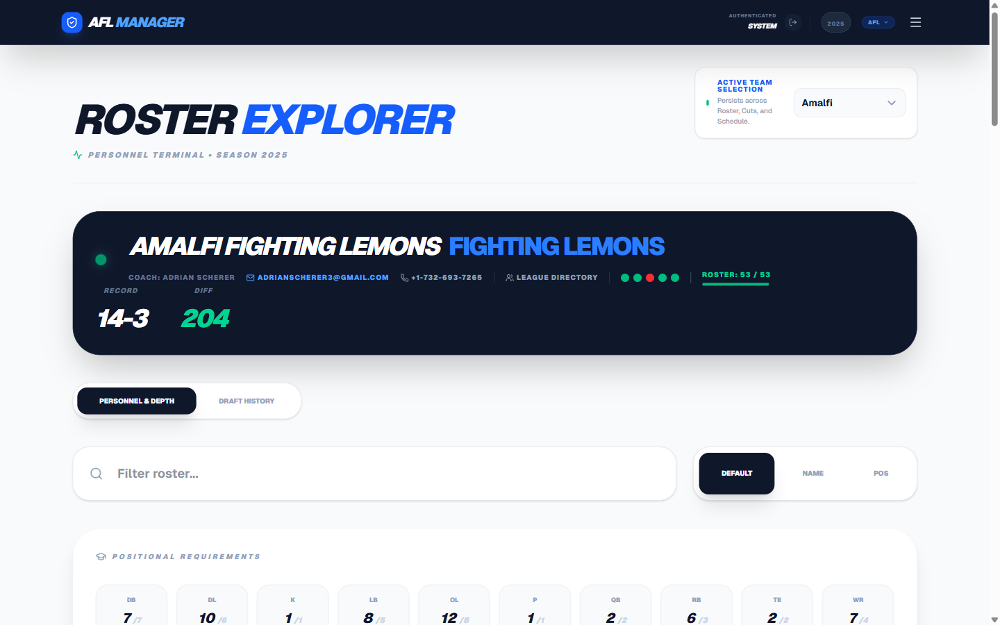

### Browsing Rosters

*   **Select a Team:** Use the dropdown menu at the top right of the page to choose a team.
*   **Player Cards:** Players are organized by position in a depth chart. Each card shows key ratings and stats.
*   **Player Details:** Click on any player card to see a detailed view of their stats, ratings, and contract information.
*   **Draft History Tab:** Switch to the Draft History tab to see the team's current and future draft picks.

### Searching and Filtering

*   **Search:** Use the search bar to find a specific player by name.
*   **Sort:** Use the sort buttons (Default / Name / Pos) to reorder the roster.

### Team Header

The dark panel at the top shows the team's coach name, contact info, win/loss record, and current roster size (e.g., 53/53).

---

## 4. League Standings: See Who's on Top

The **League Standings** page shows you the current league standings, as well as historical data.

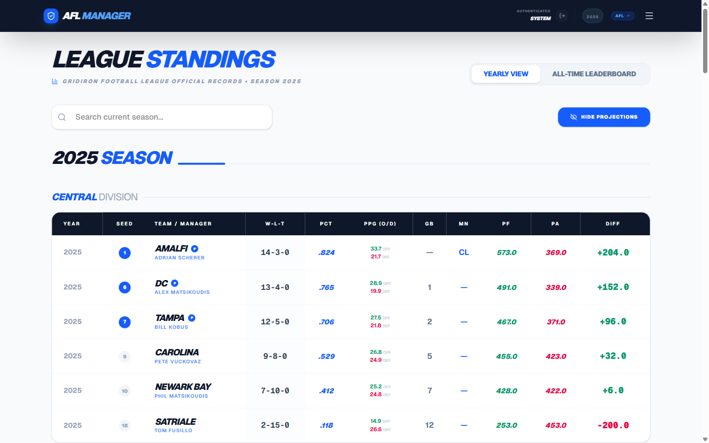

### Yearly View

This is the default view, showing the current season's standings organized by division. You can use the year selector to look at past seasons.

The table shows each team's:
*   **W-L-T** record and winning percentage
*   **PPG (O/D)** — Points per game, offense and defense
*   **PF / PA / Diff** — Points for, against, and differential

### All-Time Leaderboard

Click on the **"All-Time Leaderboard"** tab to see career statistics for every franchise, including championships, playoff appearances, and all-time records.

---

## 5. League Schedule: Plan Your Season

The **League Schedule** page shows the full season schedule, week by week. You can see upcoming matchups and the scores of completed games.

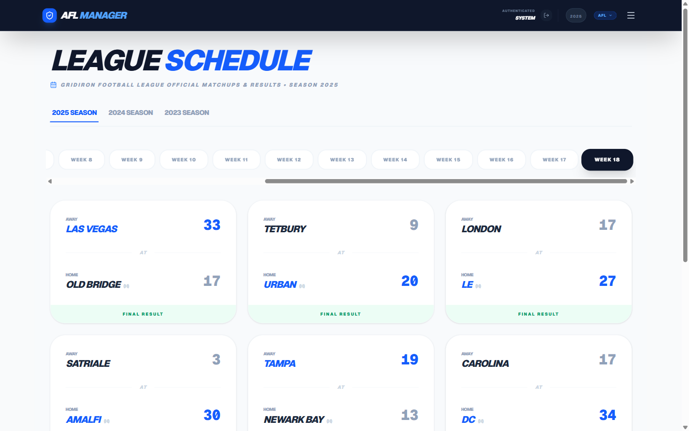

*   Use the **season tabs** (2025 Season, 2024 Season, etc.) to view different years.
*   Use the **week buttons** to jump to a specific week.
*   Completed games show a **"Final Result"** banner with both scores.

---

## 6. The Draft Board: Where Champions are Made

The **Draft Board** is the central hub for all draft activity.

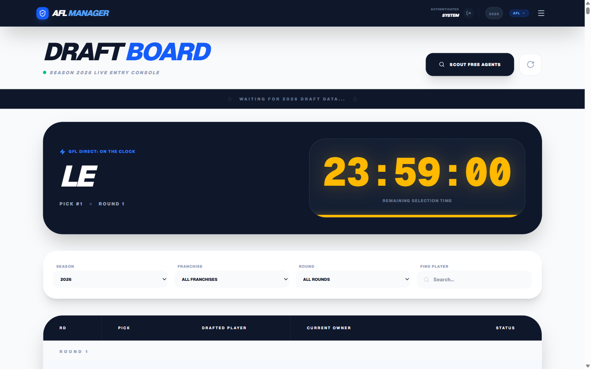

### On the Clock

The dark "On the Clock" panel shows:
*   Which team is **currently picking**
*   The **pick number** and **round**
*   A large **countdown timer** (HH:MM:SS) showing remaining selection time
*   A **progress bar** at the bottom of the panel

### Making a Pick

When it's your turn to pick, an **"Enter Selection"** button appears on your pick row. Click it to search for and select your player. If your timer expires, your pick shows "Late Selection" status — you can still submit at any time.

### Scouting Free Agents

Click the **"Scout Free Agents"** button (top right) to open the scouting panel where you can:

*   Search for players by name
*   Filter by position
*   Sort by overall rating, age, or name
*   Add players to your watchlist (star icon)

---

## 7. Transactions: Making Roster Moves

The **Transactions** page is where you can add, drop, IR, and trade players.

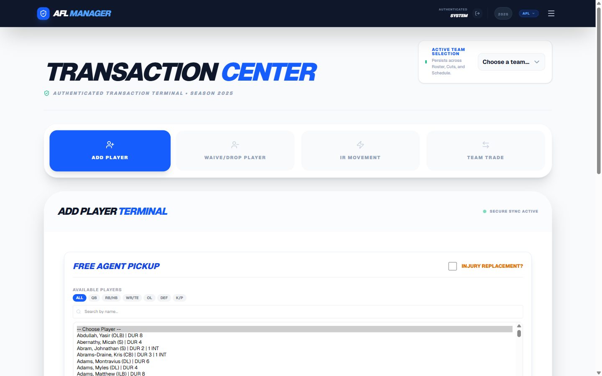

### Operation Tabs

Select your transaction type from the four tabs at the top:

*   **Add Player:** Sign a free agent from the available players list. Filter by position or search by name.
*   **Waive/Drop Player:** Remove a player from your roster, returning them to the free agent pool.
*   **IR Movement:** Move a player to or from Injured Reserve.
*   **Team Trade:** Execute a multi-asset trade with another franchise.

### Transaction Log

All transactions are logged in a table below the operation panel. You can filter by:
*   **Status:** All / Pending / On Team / Done
*   **Type:** Add, Waive, Drop, IR Move, Trade
*   **Team:** Filter to a specific franchise

### Notifications

Every transaction automatically sends an **email and WhatsApp alert** to the league group.

---

## 8. Roster Cuts: Preparing for the New Season

The **Roster Cuts** page is where you'll make decisions about which players to keep for next season.

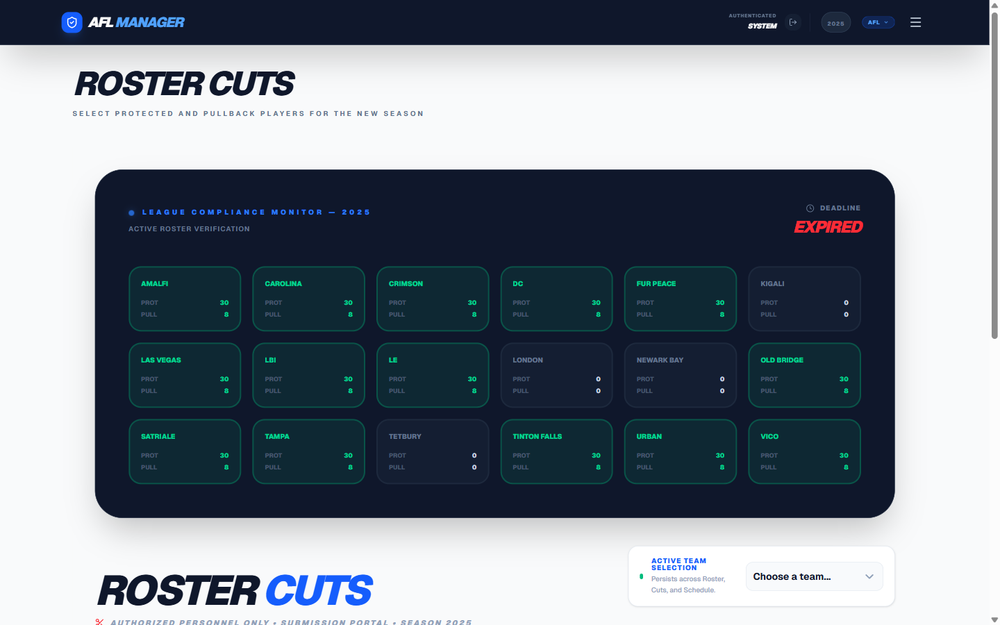

### League Compliance Monitor

The dark panel at the top shows all franchises' submission status at a glance:
*   Each team card shows **PROT** (protected) and **PULL** (pullback) counts
*   **Green** highlighted teams have fully completed their submission
*   A **deadline countdown** is shown in the top right

### Protected and Pullback Players

Each offseason, you'll designate players as:

*   **Protected (max 30):** These players stay on your roster.
*   **Pullback (max 8):** You retain first right of refusal in the draft.
*   **Released:** All remaining players are let go.

### Making Your Selections

Select your team from the dropdown, then use the **Protect**, **Pullback**, or **Release** buttons for each player. The capacity counters update in real time. Click **"Submit Roster Cut List"** when done. You can re-submit any time before the deadline.

---

## 9. The Trade Block: Make a Deal

The **Trade Block** is a public marketplace where coaches can list players they are willing to trade.

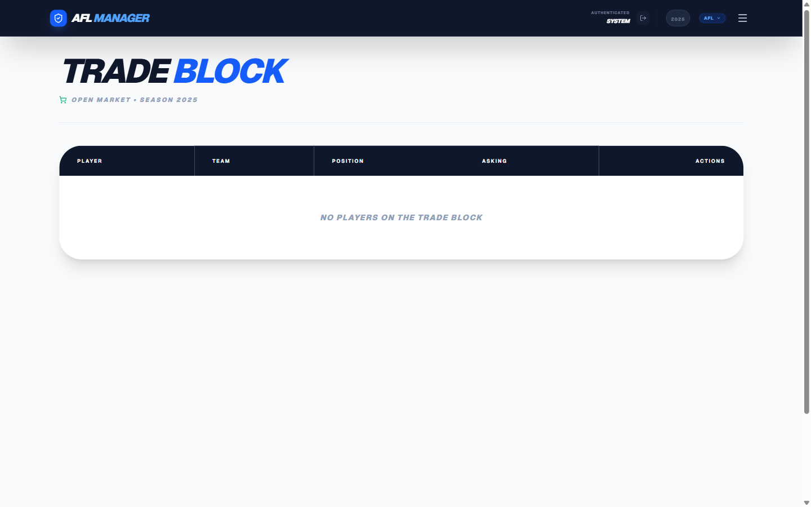

*   **View the Block:** See all players currently listed, along with what the coach is asking for in return.
*   **Post a Player:** Contact your commissioner to have a player added to the trade block.
*   **Remove a Player:** If you have a player on the block, you'll see a **"Remove"** button next to their name.

---

## 10. Coaching Hub: Upload Your COA File

The **Coaching Hub** is where you'll upload your `.COA` file for each gameday. This file contains your team's strategy and play calls.

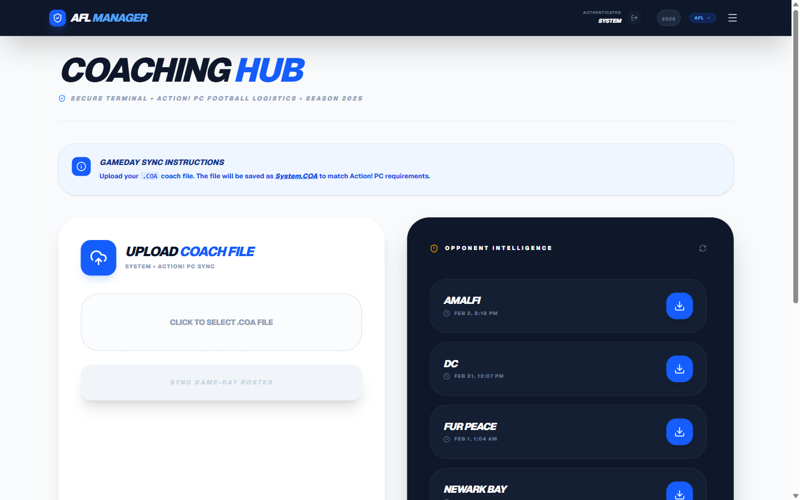

*   **Upload:** Click the upload area to select your `.COA` file. The file is saved automatically with the correct name for Action! PC Football.
*   **Opponent Intelligence:** The right panel shows all coaches' COA files available for download, with their last sync timestamp.
*   **Sync Game-Day Roster:** Once a file is selected, click this button to upload it.

---

## 11. The Press Box: Game Summaries and Analysis

The **Press Box** is the league's media center. Here you can:

*   **Upload game result files** for AI-powered analysis.
*   **Generate game summaries** using Google Gemini AI.
*   **View published summaries** from previous games.

---

## 12. League Resources: Files and Documents

The **League Resources** page is a central repository for all league files and documents. Here you can find player photos, team files, the league encyclopedia, and more. Click any link to open or download the resource.

---

## 13. League Directory: Find Your Fellow Coaches

The **League Directory** lists the contact information for all the coaches in the league.

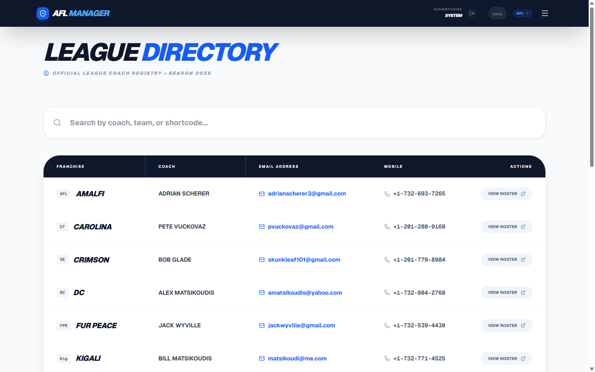

*   **Search:** Use the search bar at the top to filter by coach name, team name, or shortcode.
*   **Contact:** Click any email address to compose a message, or a phone number to dial on mobile.
*   **View Roster:** Click "View Roster" on any row to jump directly to that team's roster page.

---

## 14. Constitution & Rules: Know the Law

The **Constitution & Rules** page contains the full text of the league constitution. A table of contents on the left side of the page allows you to jump to specific sections.

---

## 15. Franchise Settings: Your Profile and Password

The **Franchise Settings** page is where you can manage your coach profile and account security.

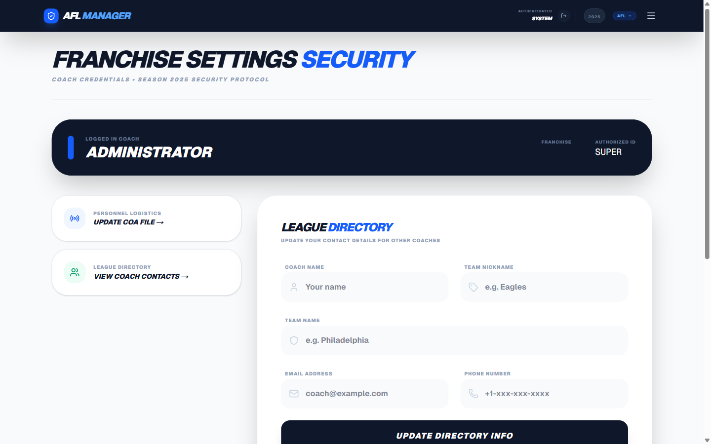

*   **Update Directory Info:** Change your coach name, team nickname, team name, email, and mobile number. Click **"Update Directory Info"** to save — changes are reflected in the League Directory immediately.
*   **Change Your Password:** Enter and confirm a new password, then click **"Save Security Settings"**.
*   **Quick Links:** Use the shortcut cards to jump to the Coaching Hub or League Directory.

---

## 16. Commissioner Panel: League Management

The **Commissioner Panel** is a special area for the league commissioner to manage the league. This page is not accessible to regular coaches.

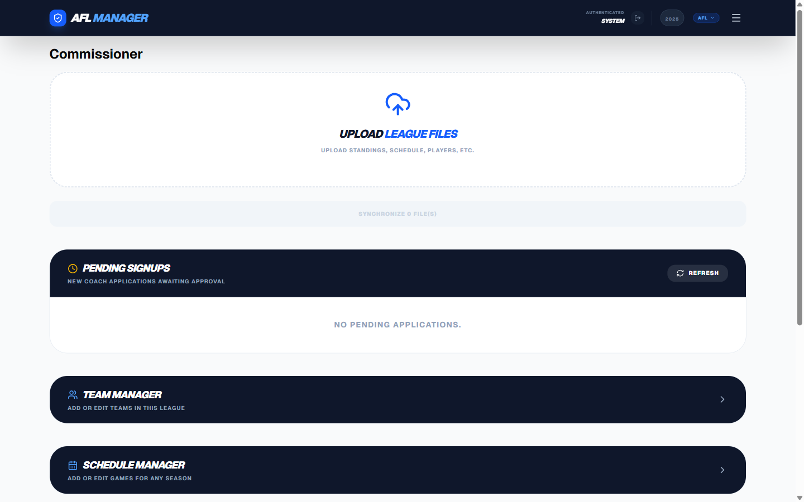

### Features for the Commissioner:

*   **Upload League Files:** Drag and drop files (players CSV, schedule, standings) to import data. Click **"Synchronize Files"** to process.
*   **Pending Signups:** Review new coach applications and click **Approve** or **Reject**.
*   **Team Manager:** Add or edit teams in the league.
*   **Schedule Manager:** Add or edit games for any season.
*   **Season Awards:** Set playoffs, division winners, and champions per season.
*   **League Settings:** Edit rules and configuration values like `cuts_year`, `draft_year`, roster limits, and deadlines.
